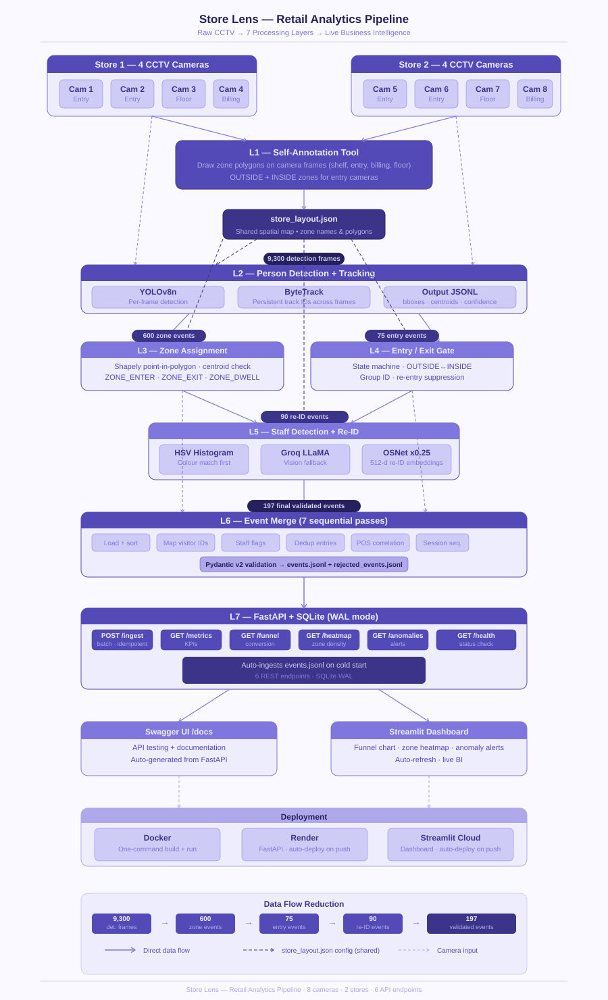
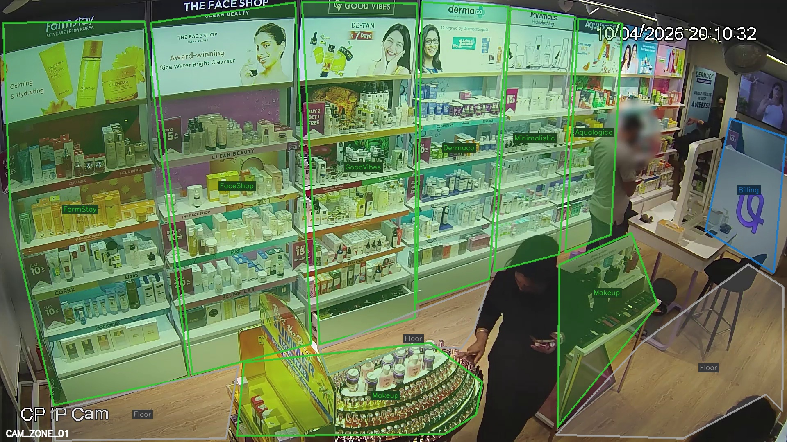
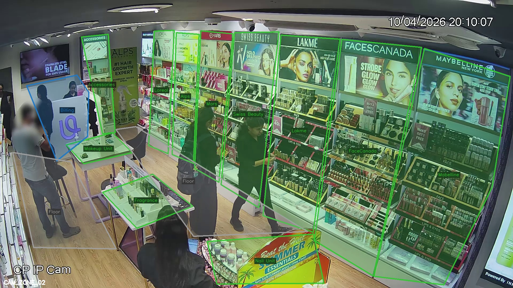
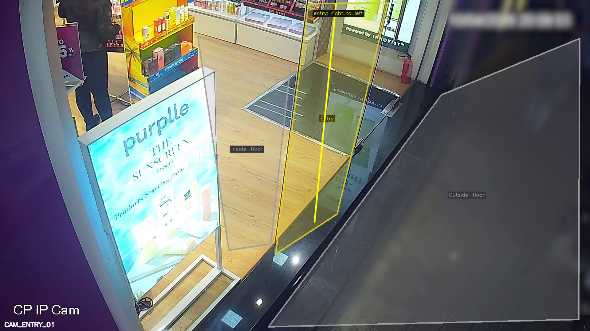
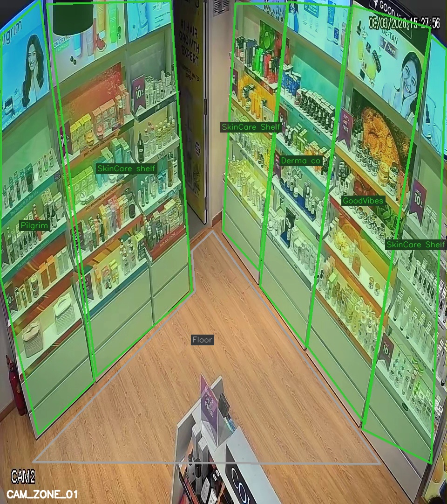
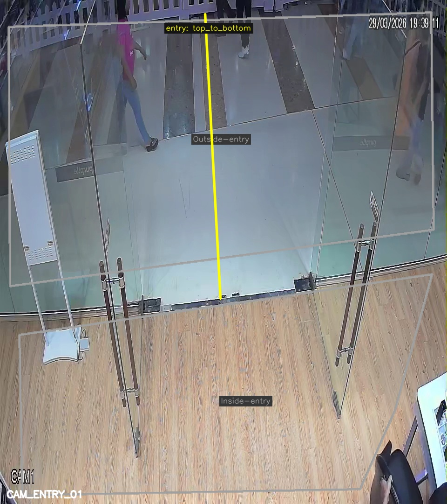
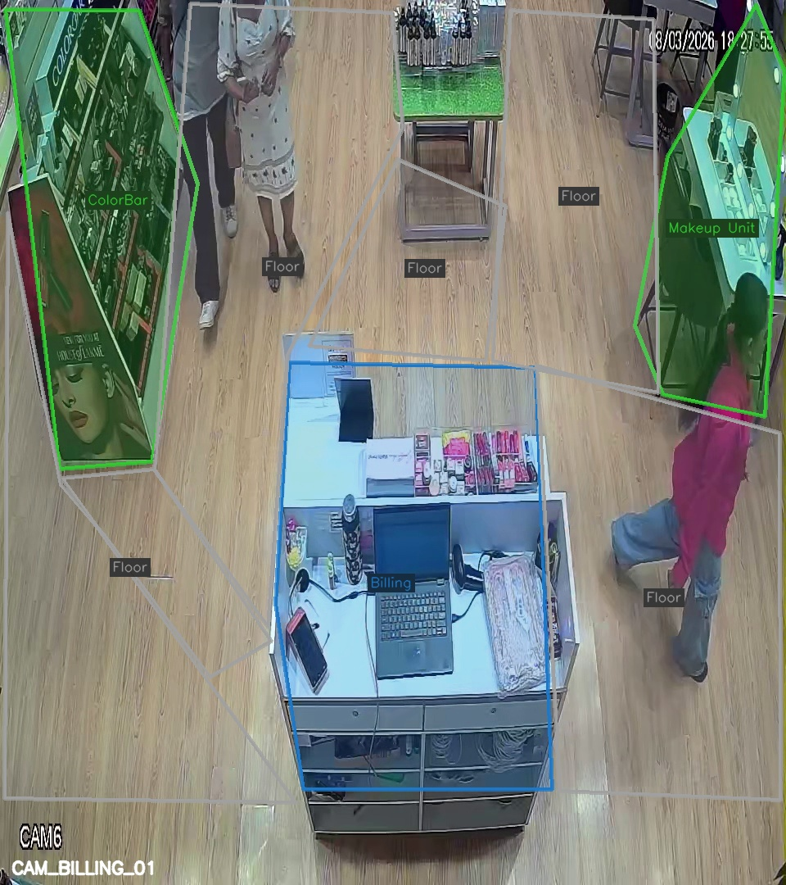

# Store Lens — Purplle Store Analytics

> Computer vision pipeline that converts raw CCTV footage from 2 Purplle beauty stores into structured retail analytics, served through a live REST API and dashboard.

**Live Dashboard:** [purplle.streamlit.app](https://purplle.streamlit.app)  
**Live API:** [store-lens.onrender.com](https://store-lens.onrender.com)  
**API Docs:** [store-lens.onrender.com/docs](https://store-lens.onrender.com/docs)

---

## Architecture



---

## Store cameras

| Store | Camera | Type | Zones |
|---|---|---|---|
| Store 1 | CAM 1, CAM 2 | zone | 13 + 14 named product zones |
| Store 1 | CAM 3 | entry | Gate crossing |
| Store 1 | CAM 5 | billing | Checkout queue |
| Store 2 | entry 1, entry 2 | entry | Dual-gate |
| Store 2 | zone | zone | Shelf presence |
| Store 2 | billing | billing | Checkout queue |

### Annotated zone maps (L1 output)

| Store 1 — Zone Cam A | Store 1 — Zone Cam B |
|---|---|
|  |  |

| Store 1 — Entry Cam | Store 2 — Zone Cam |
|---|---|
|  |  |

| Store 2 — Entry Cam | Store 2 — Billing Cam |
|---|---|
|  |  |

---

## Quickstart — Docker (recommended)

```cmd
git clone https://github.com/NIDHIPATEL2807/Store_Lens.git
cd Store_Lens
docker compose up --build
```

API starts at `http://localhost:8000` with all 197 events pre-loaded.  
Swagger UI at `http://localhost:8000/docs`

---

## Quickstart — Local

### 1. Setup

```cmd
cd pipeline
python -m venv venv
venv\Scripts\activate
pip install -r L2_Detect\requirements.txt
pip install -r L5_reid\requirements.txt
pip install -r L7_api\requirements.txt
pip install shapely gdown requests
```

### 2. Run full pipeline (both stores)

```cmd
cd pipeline
run_pipeline.cmd
```

Runs L2 → L3 → L4 → L5 → L6 → starts API → ingests events.

### 3. Or step-by-step

#### L1 — Annotate store layout (one-time)
```cmd
cd pipeline\L1_StoreLayout_selfannotate
python run_annotation.py
```

#### L2 — Person detection + tracking

**Store 1:**
```cmd
cd pipeline\L2_Detect

python run_l2.py --layout "..\L1_StoreLayout_selfannotate\output\Store 1\store_layout.json" --video "..\L1_StoreLayout_selfannotate\input\Store 1\CAM 1 - zone.mp4" --clip_start 2026-03-08T10:00:00Z
python run_l2.py --layout "..\L1_StoreLayout_selfannotate\output\Store 1\store_layout.json" --video "..\L1_StoreLayout_selfannotate\input\Store 1\CAM 2 - zone.mp4" --clip_start 2026-03-08T10:00:00Z
python run_l2.py --layout "..\L1_StoreLayout_selfannotate\output\Store 1\store_layout.json" --video "..\L1_StoreLayout_selfannotate\input\Store 1\CAM 3 - entry.mp4" --clip_start 2026-03-08T10:00:00Z
python run_l2.py --layout "..\L1_StoreLayout_selfannotate\output\Store 1\store_layout.json" --video "..\L1_StoreLayout_selfannotate\input\Store 1\CAM 5 - billing.mp4" --clip_start 2026-03-08T10:00:00Z
```

**Store 2:**
```cmd
python run_l2.py --layout "..\L1_StoreLayout_selfannotate\output\Store 2\store_layout.json" --video "..\L1_StoreLayout_selfannotate\input\Store 2\entry 1.mp4" --clip_start 2026-03-08T10:00:00Z
python run_l2.py --layout "..\L1_StoreLayout_selfannotate\output\Store 2\store_layout.json" --video "..\L1_StoreLayout_selfannotate\input\Store 2\entry 2.mp4" --camera_id CAM_ENTRY_02 --clip_start 2026-03-08T10:00:00Z
python run_l2.py --layout "..\L1_StoreLayout_selfannotate\output\Store 2\store_layout.json" --video "..\L1_StoreLayout_selfannotate\input\Store 2\billing_area.mp4" --clip_start 2026-03-08T10:00:00Z
python run_l2.py --layout "..\L1_StoreLayout_selfannotate\output\Store 2\store_layout.json" --video "..\L1_StoreLayout_selfannotate\input\Store 2\zone.mp4" --clip_start 2026-03-08T10:00:00Z
```

#### L3 — Zone assignment

```cmd
cd pipeline\L3_ZoneAssign

python run_l3.py --tracks_dir "..\L2_Detect\output\STORE_STORE_1" --layout "..\L1_StoreLayout_selfannotate\output\Store 1\store_layout.json" --output_dir "output\store1"
python run_l3.py --tracks_dir "..\L2_Detect\output\STORE_STORE_2" --layout "..\L1_StoreLayout_selfannotate\output\Store 2\store_layout.json" --output_dir "output\store2"
```

#### L4 — Entry / Exit detection

```cmd
cd pipeline\L4_entry

python run_l4.py --zone_events_dir "..\L3_ZoneAssign\output\store1" --layout "..\L1_StoreLayout_selfannotate\output\Store 1\store_layout.json" --output_dir "output\store1"
python run_l4.py --zone_events_dir "..\L3_ZoneAssign\output\store2" --layout "..\L1_StoreLayout_selfannotate\output\Store 2\store_layout.json" --output_dir "output\store2"
```

#### L5 — Staff detection + Re-ID

```cmd
cd pipeline\L5_reid

python run_l5.py ^
  --tracks_dir   "..\L2_Detect\output\STORE_STORE_1" ^
  --entry_events "..\L4_entry\output\store1\CAM_ENTRY_01__CAM 3 - entry_zone_events_entry_events.jsonl" ^
  --videos_dir   "..\L1_StoreLayout_selfannotate\input\Store 1" ^
  --layout       "..\L1_StoreLayout_selfannotate\output\Store 1\store_layout.json" ^
  --output_dir   "output\store1"

python run_l5.py ^
  --tracks_dir   "..\L2_Detect\output\STORE_STORE_2" ^
  --entry_events "..\L4_entry\output\store2\CAM_ENTRY_01__entry 1_zone_events_entry_events.jsonl" ^
  --videos_dir   "..\L1_StoreLayout_selfannotate\input\Store 2" ^
  --layout       "..\L1_StoreLayout_selfannotate\output\Store 2\store_layout.json" ^
  --output_dir   "output\store2"
```

#### L6 — Event merge

```cmd
cd pipeline\L6_emit

python run_l6.py ^
  --zone_events  "..\L3_ZoneAssign\output\store1\CAM_ZONE_01__CAM 1 - zone_zone_events.jsonl" ^
  --entry_events "..\L4_entry\output\store1\CAM_ENTRY_01__CAM 3 - entry_zone_events_entry_events.jsonl" ^
  --reid_events  "..\L5_reid\output\store1\reid_events.jsonl" ^
  --layout       "..\L1_StoreLayout_selfannotate\output\Store 1\store_layout.json" ^
  --store_id     STORE_STORE_1 --output_dir "output\store1"

python run_l6.py ^
  --zone_events  "..\L3_ZoneAssign\output\store2\CAM_ZONE_01__zone_zone_events.jsonl" ^
  --entry_events "..\L4_entry\output\store2\CAM_ENTRY_01__entry 1_zone_events_entry_events.jsonl" ^
  --reid_events  "..\L5_reid\output\store2\reid_events.jsonl" ^
  --layout       "..\L1_StoreLayout_selfannotate\output\Store 2\store_layout.json" ^
  --store_id     STORE_STORE_2 --output_dir "output\store2"
```

#### L7 — Start API

```cmd
cd pipeline\L7_api
uvicorn main:app --app-dir app --host 0.0.0.0 --port 8000
```

#### Ingest events into API

```cmd
cd pipeline\L7_api
python ingest.py
```

---

## API Endpoints

| Method | Endpoint | Description |
|---|---|---|
| `POST` | `/events/ingest` | Batch ingest up to 500 events. Idempotent. 200/207/400 |
| `GET` | `/stores/{id}/metrics` | Visitors, conversion rate, avg dwell, queue depth, abandonment |
| `GET` | `/stores/{id}/funnel` | Entry → Zone → Billing → Purchase with drop-off % |
| `GET` | `/stores/{id}/heatmap` | Zone scores 0–100, avg dwell per zone |
| `GET` | `/stores/{id}/anomalies` | BILLING_QUEUE_SPIKE · CONVERSION_DROP · DEAD_ZONE |
| `GET` | `/health` | DB ping, uptime, per-store last event, stale feed warning |

Store IDs: `STORE_STORE_1` · `STORE_STORE_2`

### Sample responses

```bash
curl https://store-lens.onrender.com/health
# {"status":"UP","db_latency_ms":1.2,"uptime_seconds":312.4,...}

curl https://store-lens.onrender.com/stores/STORE_STORE_2/funnel
# {"store_id":"STORE_STORE_2","date":"2026-03-08",
#  "stages":[{"stage":"entry","count":43},{"stage":"zone_visit","count":11,"dropoff_pct":74.4},...]}

curl https://store-lens.onrender.com/stores/STORE_STORE_1/anomalies
# {"anomalies":[{"anomaly_type":"DEAD_ZONE","severity":"INFO","description":"Zone AQUALOGICA..."}]}
```

---

## Tests

```cmd
cd pipeline\L7_api\tests
pytest -v
```

19/19 passing. Covers: ingest idempotency, 207 partial batch, 404 unknown store, funnel monotone dropoff, staff exclusion from visitor count, health UP, stale feed flag.

---

## Visualizer videos

```cmd
cd pipeline
run_visualizers.cmd
```

Saves annotated MP4s to `pipeline/output/viz/`:

| Video | Proves |
|---|---|
| `L2_Store1_zone.mp4` | YOLOv8 bounding boxes + ByteTrack IDs |
| `L2_Store2_entry.mp4` | Detection at entry camera |
| `L3_Store1_zones.mp4` | Zone polygons flashing on ZONE_ENTER/EXIT |
| `L3_Store2_zones.mp4` | Zone polygons Store 2 |
| `L4_Store2_entry.mp4` | ENTRY/EXIT banners with visitor_id + group_id |
| `L5_Store1/` | Visitor IDs + STAFF badge on crops |

---

## Live dashboard

```cmd
pip install streamlit plotly
cd dashboard
streamlit run app.py
```

Or visit: [purplle.streamlit.app](https://purplle.streamlit.app)

Auto-refreshes every 10s. Shows metrics, funnel chart, zone heatmap, anomalies, health status.

---

## Staff detection example

L5 two-stage: HSV colour matching → Groq VLM fallback (`llama-4-scout`).


---

## Data produced

| Layer | Output | Count |
|---|---|---|
| L2 | tracks.jsonl (per camera) | ~9,300 frames |
| L3 | zone_events.jsonl | ~600 events |
| L4 | entry_events.jsonl | ~75 events |
| L5 | reid_events.jsonl | ~90 events |
| L6 | events.jsonl | **197 validated events** |
| L7 DB | SQLite events table | 197 rows, 6 endpoints |

---

## Tech stack

| Component | Choice |
|---|---|
| Detection | YOLOv8n (ultralytics) |
| Tracking | ByteTrack (built into ultralytics) |
| Re-ID | OSNet x0.25 — 512-d embeddings (torchreid) |
| Staff VLM | Groq — llama-4-scout-17b |
| Zone geometry | Shapely point-in-polygon |
| API | FastAPI + uvicorn |
| Database | SQLite WAL mode |
| Validation | Pydantic v2 |
| Tests | pytest + httpx TestClient (19/19) |
| Dashboard | Streamlit + Plotly |
| Deploy | Docker + Render + Streamlit Cloud |
